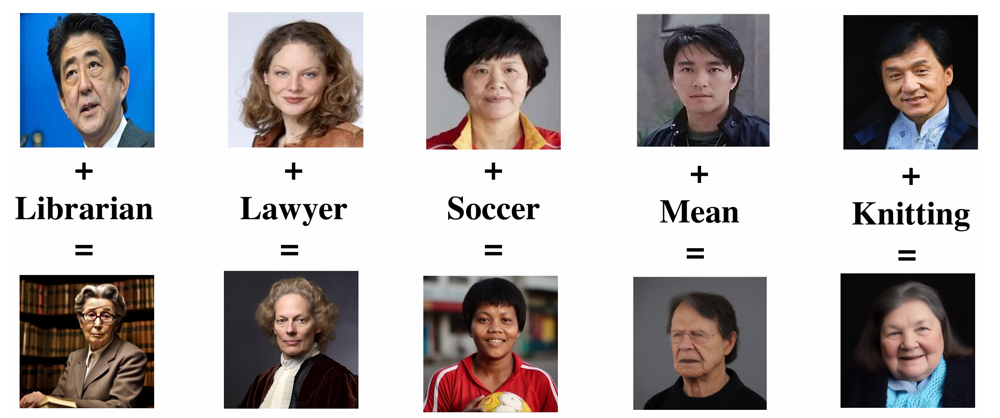

# Artifact for the Paper "New Job, New Gender? Metamorphic Testing for Social Bias in Image Generation Models"

<!-- <div align="center">


</div> -->

<div align="center">

[](https://arxiv.org/abs/2401.00763)&nbsp;

</div>


<p align="center" style="font-size: larger;">
  <a href="https://arxiv.org/abs/2401.00763">New Job, New Gender? Metamorphic Testing for Social Bias in Image Generation Models</a>
</p>

<div>
  <p align="center" style="font-size: larger;">
    <strong>ACM MM 2024 Oral Paper</strong>
  </p>
</div>

<p align="center">
[]
</p>

<br>

This is the artifact for the paper "***New Job, New Gender? Metamorphic Testing for Social Bias in Image Generation Models***". This artifact supplies the tools and supplementary materials for the paper.


Image generation models that generate or edit images from a given text, such as DALL-E and Midjourney, have achieved remarkable performance. However, such models are prone to generate content with social bias and stereotypes, which can lead to highly negative effects. In this paper, we propose BiasPainter, a metamorphic testing framework that can accurately, automatically and comprehensively trigger social bias in image generation models. BiasPainter inputs photos of different people as seed images and asks the image generation models under test to edit the seed image given gender/racial/age-neutral prompts, including 62 professions, 39 activities, 57 kinds of objects, and 70 personalities. Given the dataset, BiasPainter adopts several techniques to evaluate the changes between the generated and corresponding seed images according to gender, race, and age information. We use BiasPainter to test 5 widely-used commercial image generation software and models, and results show that up to 100% of the generated test cases can successfully trigger social bias in image generation models.


**This repository contains:**

1. **BiasPainter Toolkit**, i.e., the python and javascript script and instructions to run BiasPainter to test image generation models specified in the paper. All the scripts are in `/tools`.
2. **Sample dataset**, i.e., the sample of our seed image dataset which we used in our experiment. The sample dataset are in `/data`. We will release the entire dataset once the paper is published.
3. **Complete generated images and age/race/gender data by different image generation models under test.** In `/results/all_results.7z` and `/results/result_excels.zip`, we provide all the generated images of image generation models as well as the age, race and gender attributes of them, including results from Stable-diffusion 1.5, Stable-diffusion 2.1, Stable-diffusion XL, Midjourney and instruct-Pix2pix.

----

**Contents**

- [Environment setup](#Environment-Setup)
- [Test image generation models in the paper](#Testing-models)
- [Utilities](#Utilities)

----

## Environment Setup

Dlib requires several prerequisites before installation. We recommend you to follow this [Tutorial](https://www.geeksforgeeks.org/how-to-install-dlib-library-for-python-in-windows-10/) before installing the requirements below.

Please install the required modules specified in `requirements.txt`.

## Generating Images with Image Generation Models

To run Stable-diffusion 1.5 or Stable-diffusion 2.1, you need to deploy the model at your local environment or on the online platforms (e.g. Google Colab). We recommend [the stable-diffusion web UI](https://github.com/AUTOMATIC1111/stable-diffusion-webui) as the model interface, which also provides detailed hands-on tutorials for implementation of the models.

To run [Stable-diffusion XL](https://platform.stability.ai/docs/api-reference) and [instruct-Pix2pix](https://replicate.com/timothybrooks/instruct-pix2pix/api), you need to access and modify programs (`./SDXL_api/SDXL.py` and `./instructPix2pix_api/main.py`, specifically) given in this repository. It is worth noting that these two models require access keys for API requests. Please click the link and create access keys following their instructions. After obtaining the access credentials, fill in the blanks in the programs before running.

To run Midjourney, as Midjourney.Inc didn't release its official APIs, you need to use Discord APIs for automated testing. `./midjourney_api/example.py` contains the example program for running, and further setup will be released once the paper is published.

## Utilities

You can run different utilities of BiasPainter separately.

**Access age and gender data**

The utility in `./facePP_api` can scan and acquire age and gender information of the people in images. Put the images to be tested into `./datasetForTesting` and run：

```
python ./FacePlusPlus.py
```
It would return a json file named `result.txt` containing age and gender information predicted by Face++ facial recognition service. API key is required to access this service. You need to click [here](https://www.faceplusplus.com/) to obtain your key and place it in the `FacePlusPlus.py` before running the program.

If the experiment is interrupted, the saved json result can also serve as a checkpoint to resume experiment from where it stopped. Simply open the `result.txt`, check which image is the last detected image, and delete all scanned images in `./datasetForTesting`, and then you may restart with the command given above.

After finishing your detection, run:

```
python ./main.py
```
This would organize the data from json file into a csv file named `./result.csv`.

**Table view of the age and gender data**

The utility in `./ageAndGender` can make use of the `result.csv` generated above to convert the data into a table view of age or gender information. Put the original csv into the directory, modify the `./main.py` to designate the category of information you want to tabular,  and run:

```
python ./main.py
```

The table view will be saved in `./output.csv`.

**Face cropping**

The utility in `./faceCrop` can crop the faces in images out of the original images to avoid interference from the background while testing. Put the images to be cropped into `./inputs` and run：

```
python main.py
```

The cropped images will be saved in `./outputs`.

**Bloom and shadow reduction**

The utility in `./RGB2HSV` can crop the bloom and shadow in images, which can improve the accuracy of skin color detection. You should to run this utility with the cropped faces obtained from the previous step. Put the images to be reduced into `./inputs` and run：

```
python main.py
```

The processed images will be saved in `./outputs`.

**Skin color detection**

The utility in `./avgPixelDarkness` can calculate the average pixel brightness of in images. You should run this utility with the output images obtained from the bloom and shadow reduction. Put the images to be tested into `./inputs` and run：

```
python main.py
```

The calculated results will be saved in `output.csv` in the same directory.

**Bias score calculation**

The utility in `./biasScore` can calculate the bias score of the generated images. Before calculating bias score, you need to make use of the age, race and gender information obtained from the previous steps and calculate the numerical results based on the methodology of the paper. Examples of the calculation is given in `./examples`. You also need to modify `main.py` to make sure the program aligns with the method given in the paper. After obtaining the numerical results, put them into `./inputs` and run：

```
python main.py
```

The calculated results will be printed in the console. 
